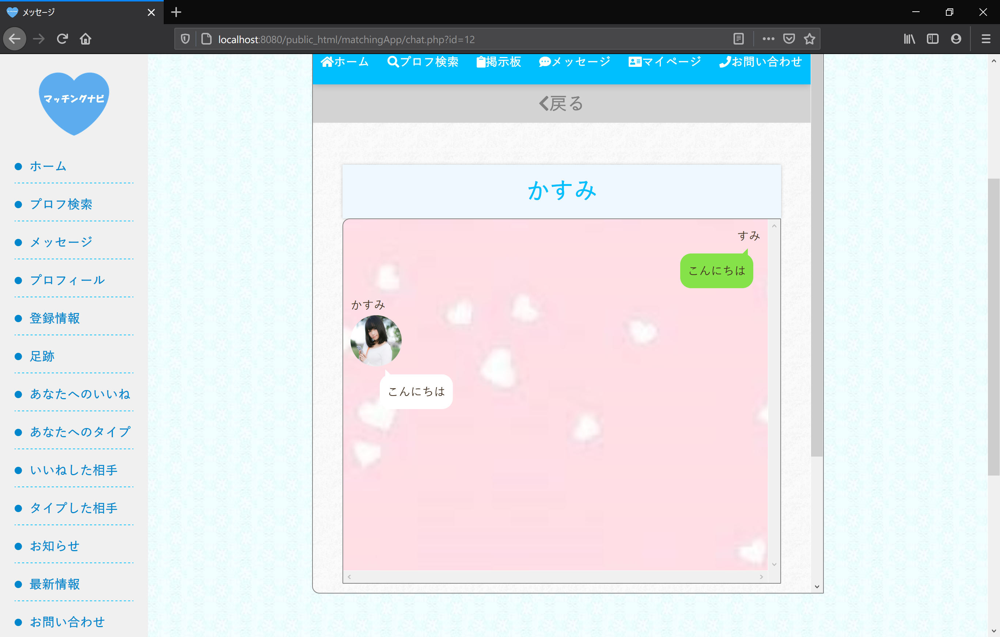

# 自作マッチングサイト「マッチングナビ」
PHPでマッチングサイトを作成したので紹介します. 
学習用のためフレームワーク (Laravelなど) は用いていません. 

## 作成サイト : マッチングナビ

<figcaption>ホーム画面</figcaption>

マッチングサイトとは, 運営側がユーザとユーザを管理し, マッチングさせるサイトである. 恋愛市場では, 特に男女の出会いの促進を目的としている. 本作品は恋愛市場を想定したサイトである.

## サービス
アプリに登録すると, ユーザーは以下のサービスを受けられる.

- プロフィール作成
- 異性ユーザーのプロフィール閲覧
- 異性ユーザーの絞り込み検索
- 異性ユーザーへのいいね・タイプボタン
- 異性ユーザーとの個人チャット
- 掲示板の作成・書き込み

ユーザーには個別の id を振り, ログアウトしても編集したプロフィールやチャットの履歴が残るようにした. また男性・女性でアカウントを分け, 互いに連絡を取れるようにした.

## レイアウト・デザイン
タイル型レイアウトを意識し, ユーザーの閲覧やメニューの表示を整理した.

<figcaption>女性ユーザー一覧表示</figcaption>

<figcaption>マイページ</figcaption>

## LINEを意識した個人チャット
チャットも現代的なデザインに倣った. LINE では左側に相手のコメントとアイコン画像, 右側に自分のコメントが配置されるデザインであり, 本作品でもそれに近いデザインを作成した.

<figcaption>チャットの様子</figcaption>

## ページ構成
全体のページ構成についてまとめた.

<figcaption>フローチャート図</figcaption>

## 起動方法
今回はWebサイトの学習用に作成したため, セキュリティ面での脆弱性(パスワード登録にmd5を用いてるなど)やデータベースにcsvファイルを用いてるなど不自由な点がある. そのためローカルでの起動を想定する. 
この場合, [zamp](https://www.apachefriends.org/jp/download.html)をおすすめする. zampはWebサーバーのApache, データベースのMySQL, プログラミング言語のPHPといったフリーソフトをパッケージとしてまとめたソフトウェアである.

推奨ブラウザ
- Google Chrome
- Firefox

これ以外のブラウザではレイアウトが崩れる可能性がある.

## 著作権等
- ユーザーの写真 : フリー素材の[PAKUTASO](https://www.pakutaso.com/)を利用.
- その他のアイコンも全てフリー素材を用いている.